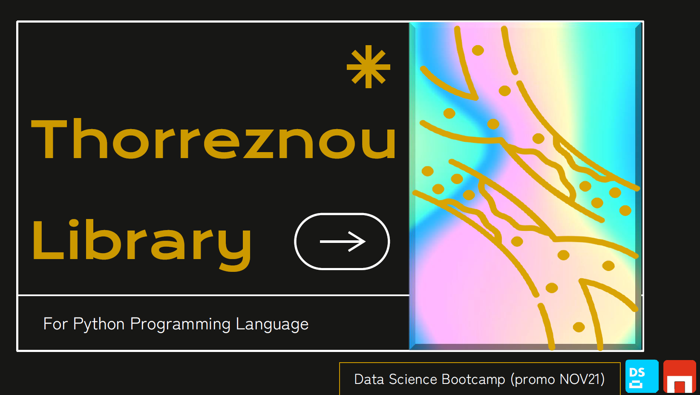

# VisualizeME functions for Thorreznoulibrary
Bootcamp en Data Science en The Bridge | Digital Talent Accelerator (Madrid, SPAIN)




### Objetivo
Obtener gráficos complejos de forma sencilla, incluyendo tablas con métricas descriptivas que complementen lo que visualmente obtengas


### Visualization functions
* visualizeME_palettes_or_colors()
* visualizeME_and_describe_violinbox()
* visualizeME_and_describe_barplot()
* visualizeME_FigureWords()
* visualizeME_bagel_look_top()
* visualizeME_and_describe_Spidey()
(futura ampliación)


### Recursos utilizados
1. Lenguaje de programación -> Python 3.7.4.

2. Librerias base utilizadas:
     * Numpy: especializada en el cálculo numérico y el análisis de datos, especialmente para un gran volumen de datos.
     * Pandas: especializada en el manejo y análisis de estructuras de datos.
     * Matplotlib: especializada en la creación de gráficos.
     * Seaborn: especializada en la creación de gráficos basada en matplotlib pero con una interfaz evolucionada que permite generar fácilmente elegantes gráficos.
     * Scipy
     * IPython
     * Os-sys
     * Worldcloud
     * Python Imaging Library (PIL)

3. Jupiter Notebooks con Visual Studio Code.

4. Power Point para explicar el alcance y funcionalidad de la libreria


### Acceso a la documentación de la librería completa
https://pypi.org/project/Thorreznou/ 


### Instalación de la libreria
```
pip install thorreznou
```


### Dependencias
El paquete requiere de la previa instalación de:
* Matplotlib
* Tensorflow
* Seaborn
* Scikit-learn
* Plotly
* Pandas
* Numpy
* Scipy
* IPython
* Os-sys
* Worldcloud
* Python Imaging Library (PIL)


#### Presentación oficial: 4 de marzo de 2022


### Autora de las mencionadas funciones de visualización:
Marta Buesa Suárez de Puga

